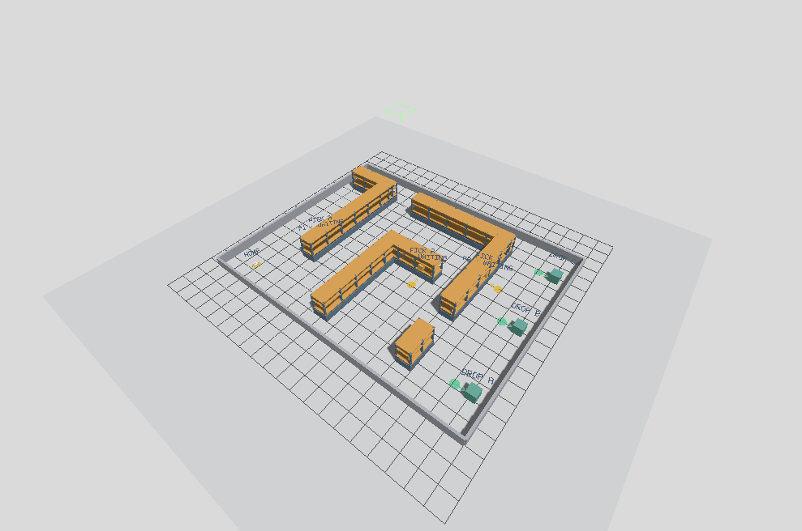
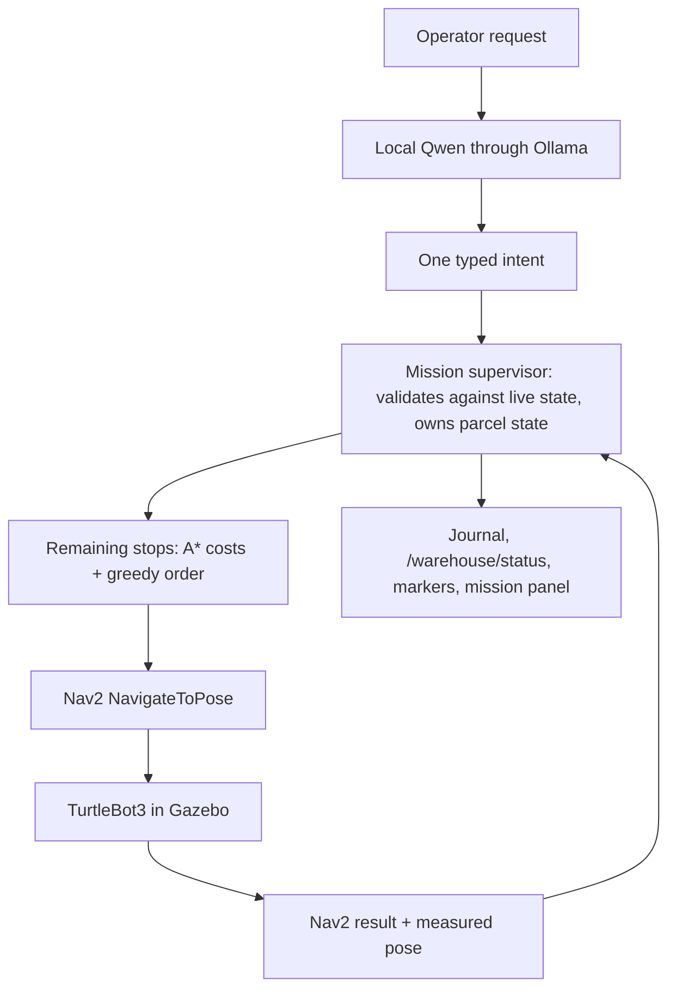
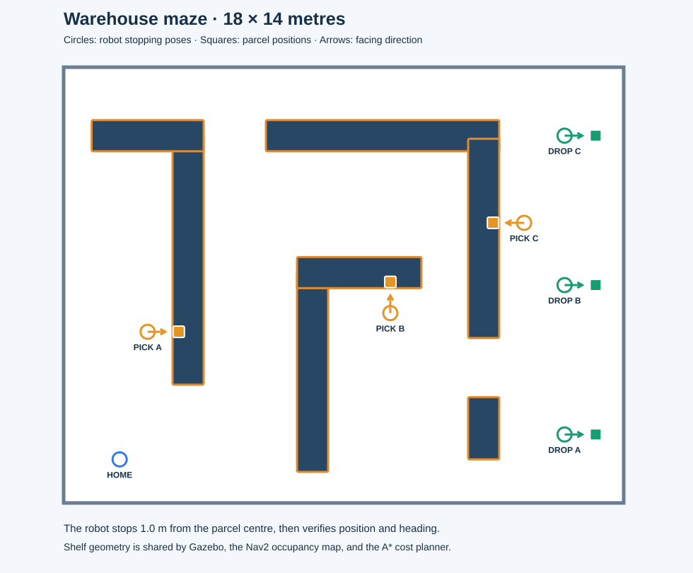
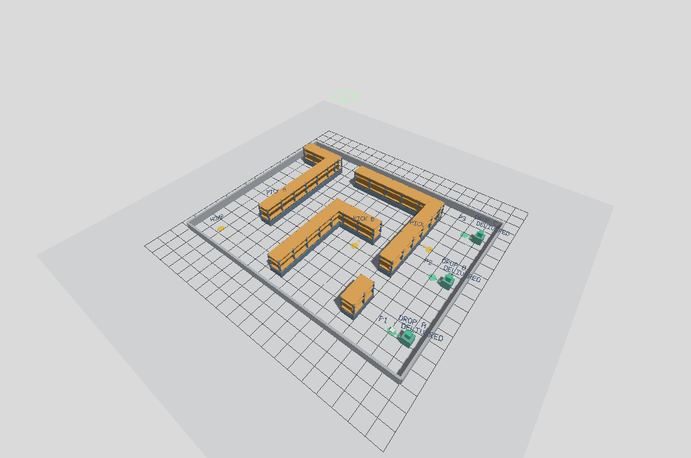

# ROS LLM Ops

[](https://github.com/ApurvK032/ros-llm-ops/actions/workflows/ci.yml) [](LICENSE)

**Tell a warehouse robot what to deliver in plain English, then change the plan while it works.**

ROS LLM Ops is a mission supervisor for a ROS 2 warehouse robot. A local language model turns operator requests into typed commands; the supervisor validates them against the robot's current state, sequences the remaining pickups and drops, and drives a TurtleBot3 through Nav2 in Gazebo. Operators can reprioritize, cancel, pause, and query the mission mid-run, and cargo only changes after the robot's arrival is verified.

**Stack:** ROS 2 Jazzy · Nav2 · Gazebo Harmonic · Python · Ollama / Qwen3.5 4B (local, no API key)



*The 18 × 14 m Gazebo warehouse, ready for a mission. Parcels wait on the shelves; ground circles mark where the robot must stop and face them.*

[Quick start](#quick-start) · [Example missions](#example-missions) · [How it works](#how-it-works) · [Results](#results) · [Roadmap](#roadmap) · [Design](docs/design.md)

## What it does

- **Natural-language missions, locally.** Qwen3.5 4B runs through Ollama with schema-constrained output. The model only proposes one typed intent; it never sees coordinates, moves the robot, or reports outcomes.
- **Changes while the robot is moving.** Prioritize a parcel, deliver onboard cargo first, cancel an uncollected order, pause, resume, or ask what the robot is carrying.
- **State that stays correct.** A cancel waits for Nav2 to confirm the goal has ended before anything new is dispatched; cargo is frozen while the model is thinking; an onboard parcel is never silently dropped from the mission.
- **Verified transfers.** Pickup and drop require Nav2 success plus measured position, heading, facing, and clearance checks. A failed stop gets one retry, then is deferred with the measured reason.
- **Planning over live state.** Remaining stops are rebuilt at every action boundary and ordered greedily with A* travel-cost estimates, honoring pickup-before-drop, priority, and onboard-first.
- **One geometry source.** A single config generates the Gazebo world, the Nav2 map, the planning grid, and the spawn pose.
- **Checked, not just tested.** An independent checker rebuilds any run from its journal and verifies every safety rule; all recorded Gazebo runs pass. Property-based tests drive the supervisor through hundreds of random sessions, and planted bugs are caught.
- **Observable.** Live RViz and Gazebo markers, a mission panel, a browser desktop over SSH, and a JSONL journal of every request, plan, navigation result, and cargo change.

Pickup and drop are logical state changes; there is no arm or grasping.

## How it works



The model decides **what the operator wants**; the supervisor decides **what is allowed and what happens next**; Nav2 handles motion. Direct controls such as `/pause` bypass the model entirely. The [design doc](docs/design.md) covers the parcel state model, request rules, timing rules, planning, and known limitations.

### The warehouse

| Parcel | Pickup | Drop |
| --- | --- | --- |
| P1 | `PICK_A` | `DROP_A` |
| P2 | `PICK_B` | `DROP_B` |
| P3 | `PICK_C` | `DROP_C` |

Seven rack sections form aisles and L-shaped corners across 18 × 14 m. The robot starts at `HOME` and must stop 1.0 m in front of each parcel, facing it, before a transfer counts. Geometry, stations, and tolerances live in [config/warehouse.json](config/warehouse.json); edit it and restart the simulator to regenerate everything.



See the [warehouse layout guide](docs/warehouse-layout.md) for the floor plan and transfer checks.

## Quick start

### 1. Clone and run the tests

Use **Python 3.12+**. No ROS, GPU, model, or extra packages are needed.

```bash
git clone https://github.com/ApurvK032/ros-llm-ops.git
cd ros-llm-ops
python3 -B -m unittest discover -s tests -v
python3 -B -m warehouse_agent doctor
```

`doctor` reports what it observes about your environment; it installs nothing. With `pip install hypothesis`, the same test command also runs the property-based tests. To check any mission journal against the supervisor's rules:

```bash
python3 -B -m warehouse_agent verify docs/evidence/maze/delivery.jsonl
```

### 2. Prepare the simulation environment

The simulation runs on **Ubuntu 24.04** with ROS 2 Jazzy, Gazebo Harmonic, and Ollama (tested on WSL2 with Ollama 0.33.3). The installer configures the official ROS package source and installs Jazzy, Nav2, the TurtleBot3 simulation, Gazebo integration, Qt, and build tools; it refuses other Ubuntu versions.

```bash
# Preview the installer, then apply it inside Ubuntu 24.04.
bash scripts/install_ros_jazzy.sh
bash scripts/install_ros_jazzy.sh --apply
```

Install Ollama using its [official Linux instructions](https://docs.ollama.com/linux). The launcher starts Ollama if needed and downloads [qwen3.5:4b](https://ollama.com/library/qwen3.5:4b) on first use; after that, inference runs locally. Use Ubuntu 24.04's system `python3` so the apt-installed ROS packages are importable.

### 3. Launch and give it a mission

With no other warehouse demo running:

```bash
bash scripts/demo.sh
```

Wait for `Nav2 and localization ready`, then type into the **agent terminal**:

```text
Deliver all three parcels
```

Gazebo, RViz, and the mission panel open. Parcels change from **amber → blue → green** as they go from waiting to onboard to delivered. A cold model load can take about a minute.

For a single mission that exits when it finishes:

```bash
bash scripts/demo.sh --command 'Deliver all three parcels'
```

<details>
<summary>Two-distribution WSL setup</summary>

If your source checkout and ROS runtime live in different WSL distributions, the wrapper syncs sources into the runtime copy before launching:

```bash
bash scripts/wsl.sh demo
bash scripts/wsl.sh demo --command 'Deliver all three parcels'
bash scripts/wsl.sh logs
```

It defaults to the `Ubuntu-24.04` distribution, your current username, and `~/ros-llm-ops` in the runtime; see the [environment guide](docs/environment.md#wsl-wrapper-configuration) to override them.

</details>

## Example missions

Enter one instruction at a time and wait for it to be interpreted before sending the next.

| Instruction | When | Expected behavior |
| --- | --- | --- |
| `Deliver all three parcels` | Fresh mission | Schedule P1, P2, and P3, pickup before drop |
| `Deliver P1 and P2` | Fresh mission | Schedule only those two |
| `Make P3 the highest priority` | P3 active and unfinished | Serve P3's remaining stops first |
| `Deliver the parcels already onboard first` | Robot carrying cargo | Drop current cargo before any new pickup |
| `Cancel order P2` | P2 active and still on its shelf | Cancel P2 once any navigation cancel is confirmed |
| `What are you carrying?` | Any time | Show the supervisor's state, not the model's opinion |
| `Deliver P9` | Any time | Ask for clarification; P9 does not exist |

| Direct command | Behavior |
| --- | --- |
| `/status` | Print the current mission state |
| `/pause` | Stop the robot (Nav2 cancel) and hold the mission |
| `/resume` | Continue the remaining work |
| `/quit` | Stop the agent; the combined launcher also stops the simulation |

**Try a live update:** start all three deliveries, enter `/pause`, enter `Make P3 the highest priority`, then `/resume`. The new stop order appears when execution resumes. Cancelling a parcel that is already **onboard** pauses and asks what to do; `/resume` continues its original delivery.

Full walkthroughs with expected observations: [examples/missions.md](examples/missions.md).

## Watch and control it in a browser

The real Gazebo, RViz, mission panel, and terminal can run on a private virtual desktop, streamed with noVNC through an SSH tunnel. After setup steps 1–2:

```bash
bash scripts/install_browser.sh --apply
ollama pull qwen3.5:4b   # needs `ollama serve` running; the browser launcher requires the model
bash scripts/run_browser.sh
```

Get the generated password with `bash scripts/run_browser.sh info`, forward the port from your own computer with `ssh -N -L 6080:127.0.0.1:6080 YOUR_SSH_HOST`, and open [the browser desktop](http://localhost:6080/vnc.html?autoconnect=1&resize=scale&reconnect=1). The gateway binds to loopback only. Details and troubleshooting: [browser access guide](docs/browser-access.md).

## Results



In the current maze, `Deliver all three parcels` completed 3 pickups and 3 drops with all six Nav2 goals succeeding, **123.0 s** after the intent was accepted. An independent observer compared every transfer with Gazebo's ground-truth robot pose:

| Check at transfer (ground truth) | Worst case | Limit |
| --- | --- | --- |
| Distance from the approach pose | 0.132 m | 0.20 m |
| Facing error toward the parcel | 10.1° | 14.3° |
| Conservative parcel clearance | 0.422 m | ≥ 0.20 m |

30 unit tests run in CI on every pull request. Earlier runs in the original layout covered browser-operated delivery and mid-mission pause, cancel, priority, and onboard-first updates against Nav2. These are single development runs, not a reliability benchmark; see [results](docs/results.md) for every measurement and its evidence.

## Project map

| Path | Responsibility |
| --- | --- |
| [config/warehouse.json](config/warehouse.json) | Geometry, stations, parcels, and tolerances |
| [warehouse_agent/language.py](warehouse_agent/language.py) | Model prompt and intent schema |
| [warehouse_agent/mission.py](warehouse_agent/mission.py) | Authoritative mission state, request rules, execution, and journal |
| [warehouse_agent/state.py](warehouse_agent/state.py) | Parcel, navigation-goal, and hold state machines |
| [warehouse_agent/verify.py](warehouse_agent/verify.py) | Independent journal checker (`warehouse_agent verify`) |
| [warehouse_agent/planner.py](warehouse_agent/planner.py), [astar.py](warehouse_agent/astar.py) | Remaining-stop ordering and travel-cost estimates |
| [warehouse_agent/world.py](warehouse_agent/world.py) | Arrival checks and generated world and maps |
| [warehouse_agent/ros_backend.py](warehouse_agent/ros_backend.py) | Nav2 goals, cancellation, measured pose, and status topic |
| [warehouse_agent/visualization.py](warehouse_agent/visualization.py) | RViz and Gazebo markers and the mission panel |
| [warehouse_agent/cli.py](warehouse_agent/cli.py) | Operator loop and direct controls |
| [sim/](sim/), [scripts/](scripts/) | Launch configuration, Gazebo marker helper, installers, and launchers |
| [tests/](tests/) | Unit and property-based tests (no ROS required) |
| [docs/](docs/) | Design, results, guides, and recorded evidence |

## Roadmap

- [x] Local model → supervisor → Nav2 → Gazebo delivery pipeline with verified logical transfers
- [x] Mid-mission pause, resume, cancel, priority, and onboard-first
- [x] Shelf maze with separate approach poses and ground-truth-checked transfers
- [x] Live visualization, mission panel, and browser access
- [x] **Correctness core, part 1:** independent journal checker, property-based tests with a mutation check, and explicit state machines
- [x] **Correctness core, part 2:** request IDs with exactly one recorded outcome each, and journaling the normalized command that was applied
- [ ] **ROS 2-native packaging:** colcon packages, typed messages and actions, a lifecycle supervisor node, a C++ approach-and-verify action server, and Docker
- [ ] **Richer operations:** orders added mid-mission, robot capacity, multi-part requests, a plan preview before changes commit, and better sequencing
- [ ] **Reliability campaign:** fault injection (blocked aisles, Nav2 aborts, cancel races) with repeated trials and published results
- [ ] Later: multiple robots with task allocation, an operator dashboard, and sensor-based arrival verification

Current limitations are listed in the [design doc](docs/design.md#known-limitations).

## Documentation

- [Design](docs/design.md): architecture, state model, request and timing rules, planning, limitations
- [Results](docs/results.md): every measurement with its evidence
- [Runbook](docs/runbook.md): operation, separate terminals, troubleshooting
- [Environment](docs/environment.md) and [browser access](docs/browser-access.md): setup guides
- [Warehouse layout](docs/warehouse-layout.md) and [visual guide](docs/visuals.md): floor plan, markers, and panel
- [Archive](docs/archive/README.md): planning documents and the related-work survey from before the build

This project grew out of my earlier [WarehouseBot Pick-and-Drop Optimization](https://github.com/ApurvK032/WarehouseBot-Pick-and-Drop-Optimization); its A* is included unchanged in [warehouse_agent/astar.py](warehouse_agent/astar.py). The [reference audit](docs/reference-audit.md) lists what was reused and adapted. To reproduce that project's offline planner results, run `bash scripts/fetch_reference.sh` and then `python3 -B -m warehouse_agent baseline`.

## License

MIT. See [LICENSE](LICENSE).
