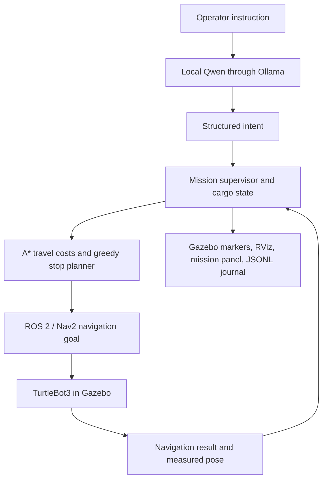

# ROS LLM Ops

**Tell a warehouse robot what to deliver. Watch it plan, navigate, and track its cargo.**

ROS LLM Ops connects a local language model to a working ROS 2 warehouse simulation. Type a delivery request, and a mission supervisor turns it into ordered pickup and drop stops for a TurtleBot3 in Gazebo. You can change priorities, pause the robot, and inspect the mission while it runs.

**Stack:** ROS 2 Jazzy · Gazebo Harmonic · Nav2 · Python · Ollama / Qwen3.5 4B


*The actual 18 × 14 m Gazebo warehouse, ready for a mission. Shelf-side parcels and robot approach circles are separate. The simulation can be operated through a browser over SSH.*

[Quick start](#quick-start) · [Example missions](#example-missions) · [Browser access](#watch-and-control-it-in-a-browser) · [How it works](#how-it-works) · [Results](#verified-results) · [Roadmap](#roadmap)

## What works today

- **Local language control:** Qwen interprets requests through Ollama; inference needs no hosted API or API key.
- **Delivery planning:** A* estimates travel costs, and a greedy planner sequences the remaining stops with pickup-before-drop, priority, and onboard-first constraints.
- **Simulated navigation:** Nav2 drives one TurtleBot3 through an 18 × 14 m warehouse with seven shelf sections arranged as a maze and six delivery stations.
- **Mission updates:** change a parcel's priority, cancel an uncollected order, pause, resume, or query cargo during execution.
- **Approach and face:** the robot stops in front of each parcel, facing it. Pickup and drop require navigation success, approach-position and heading checks, and clearance from the parcel.
- **Live visualization:** labeled stations, moving parcel markers, a current-goal indicator, RViz, and a read-only mission panel.
- **Remote operation:** the actual desktop is available through noVNC and an SSH tunnel.
- **Execution records:** JSONL journals capture requests, interpreted intent, routes, navigation results, and cargo changes.

**MVP scope:** pickup and drop are logical state changes at known stations. There is no arm, object detection, or physical grasping. The current goal is a complete, inspectable simulation before adding robustness experiments.

## How it works



The model interprets **what the operator wants**. The application validates that intent, maintains parcel state, and decides what work remains. Nav2 handles robot motion. The model has no shell or direct motor-control access.

At each stop, the supervisor checks arrival before updating cargo. An unsuccessful navigation attempt gets one application retry; a second failure defers the parcel while preserving its last confirmed cargo state. Pause and cancellation wait for the current navigation action to finish cancelling before replacement work is dispatched.

### Warehouse layout

| Parcel | Pickup | Drop |
| --- | --- | --- |
| P1 | `PICK_A` | `DROP_A` |
| P2 | `PICK_B` | `DROP_B` |
| P3 | `PICK_C` | `DROP_C` |

The robot starts at `HOME`. Geometry, waypoints, parcel assignments, and arrival tolerances live in [config/warehouse.json](config/warehouse.json). Robot approach poses are separate from parcel positions: the robot stops 1.0 m from each parcel centre and faces it before transfer. The simulator world and both planning maps are generated from the same geometry. The language prompt currently describes these three fixed parcel assignments.


See the [warehouse layout guide](docs/warehouse-layout.md) for the floor plan, approach geometry, and transfer checks.

| Current configuration | Value |
| --- | --- |
| Floor area | 18 × 14 m (252 m²) |
| Shelf layout | Seven rack sections with staggered aisles and L-shaped corners |
| Delivery task | Three parcels, three shelf pickups, three delivery pedestals |
| Robot stopping point | 1.0 m from the parcel centre, facing the parcel |
| Transfer checks | Position ≤ 0.20 m; heading ≤ 0.22 rad; facing ≤ 0.25 rad; clearance ≥ 0.20 m |

To change the layout, edit the configuration and restart the simulator. It regenerates the Gazebo world, Nav2 map, planning grid, spawn pose, and overview camera. Both Gazebo screenshots on this page show this configuration; older captures are retained only as historical evidence.

## Quick start

### 1. Clone and check the core

Use **Python 3.12+**. These checks do not require ROS, a GPU, or a running model. Fetching the pinned planner requires Git and internet access.

```bash
git clone https://github.com/ApurvK032/ros-llm-ops.git
cd ros-llm-ops
bash scripts/fetch_reference.sh
python3 -B -m unittest discover -s tests -v
python3 -B -m warehouse_agent baseline
python3 -B -m warehouse_agent doctor
```

The baseline reproduces the original planner's offline grid example. It is separate from the Gazebo delivery mission. `doctor` reports the environment it observes; it does not install dependencies.

### 2. Prepare the simulation environment

Run the full simulation inside **Ubuntu 24.04** with a desktop display or the browser desktop below. The tested runtime is Ubuntu 24.04 on WSL2, Python 3.12, ROS 2 Jazzy, Gazebo Harmonic, and Ollama 0.33.3. Local GPU inference is supported; minimum hardware requirements have not been benchmarked.

The installer configures the official ROS package source and installs Jazzy, Nav2, the TurtleBot3 simulation, Gazebo integration, Qt, and build tools. It refuses other Ubuntu versions.

```bash
# Preview the installer, then apply it inside Ubuntu 24.04.
bash scripts/install_ros_jazzy.sh
bash scripts/install_ros_jazzy.sh --apply
```

Install Ollama using its [official Linux instructions](https://docs.ollama.com/linux). The default model is [qwen3.5:4b](https://ollama.com/library/qwen3.5:4b). The combined launcher starts Ollama if needed and downloads this model on first use. Initial package and model downloads need internet access; inference runs locally afterward.

Use the system `python3` supplied with Ubuntu 24.04 for the ROS launch scripts so it can import the apt-installed ROS packages. Run commands from this checkout; the project also reads its configuration and simulation files here.

### 3. Launch and give it a mission

With no other warehouse demo running:

```bash
bash scripts/demo.sh
```

Wait for `Nav2 and localization ready`, then enter this in the **agent terminal**:

```text
Deliver all three parcels
```

The launcher opens Gazebo, RViz, and the mission panel. Watch parcels change from **amber → blue → green** as they move from waiting to onboard to delivered. A cold model load can take about a minute on the tested machine.

For a single delivery run that exits when the mission finishes:

```bash
bash scripts/demo.sh --command 'Deliver all three parcels'
```

<details>
<summary>Using the existing two-distribution WSL development setup</summary>

The prepared development machine keeps sources in Ubuntu 26.04 and runs ROS in a separate `Ubuntu-24.04` distribution. Its wrapper syncs sources before launching:

```bash
bash scripts/wsl.sh demo
# Or a single autonomous mission:
bash scripts/wsl.sh demo --command 'Deliver all three parcels'
bash scripts/wsl.sh logs
```

The wrapper defaults to `Ubuntu-24.04`, the current shell's username, and `ros-llm-ops` under the runtime user's home directory. Set `WAREHOUSE_WSL_DISTRO`, `WAREHOUSE_WSL_USER`, or `WAREHOUSE_WSL_TARGET` to override these locally. See the [environment guide](docs/environment.md#wsl-wrapper-configuration). You can also work directly in your Ubuntu 24.04 checkout using `scripts/demo.sh`.

</details>

## Example missions

Enter one instruction at a time and wait for its interpretation before submitting another. These are individual examples, not a script to paste all at once.

| Instruction | When to use it | Expected behavior |
| --- | --- | --- |
| `Deliver all three parcels` | Fresh mission | Schedule P1, P2, and P3, respecting pickup before drop. |
| `Deliver P1 and P2` | Fresh mission | Schedule only those two parcels. |
| `Make P3 the highest priority` | P3 is active and unfinished | Replan remaining work to favor P3. |
| `Deliver the parcels already onboard first` | The robot carries cargo | Put onboard deliveries ahead of new pickups. |
| `Cancel order P2` | P2 is active and still uncollected | Cancel its remaining work after acknowledging any navigation cancellation. |
| `What are you carrying?` | During a mission | Show application state, including confirmed cargo. |
| `Deliver P9` | Any time | Ask for clarification; P9 is not a configured parcel. |

Direct controls bypass the language model:

| Command | Behavior |
| --- | --- |
| `/status` | Print current mission state. |
| `/pause` | Request a pause and cancel active navigation. |
| `/resume` | Continue remaining work. |
| `/quit` | Stop the agent; the combined launcher cleans up its simulation. |

**Try a live update:** start all three deliveries, enter `/pause`, wait until navigation stops, enter `Make P3 the highest priority`, wait for the interpreted request, then enter `/resume`. The refreshed stop order appears once execution resumes.

Cancelling an **onboard** parcel pauses for clarification and keeps the cargo onboard. `/resume` continues its original delivery; return-to-sender behavior is not implemented.

See [examples/missions.md](examples/missions.md) for complete walkthroughs, expected observations, and a sample event sequence.

## Watch and control it in a browser

After completing setup steps 1–2, install the browser dependencies and download the model before starting the remote desktop. If Ollama is not already running, start `ollama serve` in another terminal first.

```bash
bash scripts/install_browser.sh --apply
ollama pull qwen3.5:4b
bash scripts/run_browser.sh
```

In a second **remote** terminal, retrieve its generated password:

```bash
bash scripts/run_browser.sh info
```

On your **local** computer, forward the remote desktop port:

```bash
ssh -N -L 6080:127.0.0.1:6080 YOUR_SSH_HOST
```

Open [the browser desktop](http://localhost:6080/vnc.html?autoconnect=1&resize=scale&reconnect=1), enter the password, and type a mission in the terminal at the bottom. The gateway binds to loopback; keep the SSH tunnel and remote launcher running.

On the prepared two-distribution WSL machine, use `bash scripts/wsl.sh browser` and `bash scripts/wsl.sh browser-info` instead. Stop it with `bash scripts/wsl.sh browser-stop`; direct Ubuntu users can use `bash scripts/run_browser.sh stop`.

The browser displays the real Gazebo, RViz, mission-panel, and terminal windows. Click **RViz** in the taskbar to inspect the navigation map. Minimize it when done: closing RViz shuts down the current stock Nav2 launch. Browser mode uses software rendering for its virtual display; Ollama still uses the available GPU.

Connection alternatives and troubleshooting: [browser access guide](docs/browser-access.md).

## Verified results


The expanded maze completed three pickups and three deliveries in **123.044 seconds** after intent acceptance, with all six Nav2 goals succeeding. Every transfer also passed an independent comparison with Gazebo's actual robot pose.

| Current maze check | Recorded result |
| --- | --- |
| Largest actual distance from an approach pose at transfer | 0.132 m; limit 0.20 m |
| Largest actual facing error toward the parcel | 10.1°; limit about 14.3° |
| Smallest conservative actual parcel clearance | 0.422 m; minimum 0.20 m |
| Automated core, CLI, visual-state, and geometry tests | 22 passing on Python 3.12 and 3.14 |

[Results and ground-truth measurements](docs/evidence/maze/results.json) · [Delivery journal](docs/evidence/maze/delivery.jsonl) · [Validation notes](docs/evidence/maze/README.md)

These are development checks, not a reliability benchmark. Localization was adjusted after the first larger-scene run exposed a pose jump during a turn.

<details>
<summary>Earlier results from the original 10 × 8 m MVP</summary>

The following runs used the earlier layout and position-only transfer checks:


| Check | Recorded result | Evidence |
| --- | --- | --- |
| Gazebo delivery with live visual state | 3 pickups, 3 deliveries, 6 successful navigation goals; 63.779 s after intent acceptance | [Results](docs/evidence/stage1/results.json) · [Journal](docs/evidence/stage1/delivery.jsonl) |
| Arrival validation in that run | Largest measured station error: 0.2379 m; tolerance: 0.35 m | [Results](docs/evidence/stage1/results.json) |
| Browser-operated delivery | Browser login and keyboard input verified; all 3 deliveries completed in 63.171 s after intent acceptance | [Browser check](docs/evidence/browser/browser-test.json) · [Journal](docs/evidence/browser/delivery.jsonl) |
| Mid-mission updates | Pause, resume, cancellation, priority, status, and onboard-first exercised against Nav2/Gazebo | [Live-update journal](docs/evidence/gazebo-live-updates.jsonl) |
| Automated core, CLI, and visual-state checks | 15 tests passed on Python 3.12 and 3.14 using a simulated backend double | [Python 3.12 log](docs/evidence/stage1/stage1-tests-ros.log) · [Python 3.14 log](docs/evidence/stage1/stage1-tests-source.log) |

</details>

Run journals are written under `artifacts/episodes/` in the runtime checkout. The ROS topic `/warehouse/status` publishes the current mission as JSON in `std_msgs/String`.

## Project map

| Path | Responsibility |
| --- | --- |
| [config/warehouse.json](config/warehouse.json) | Warehouse geometry, parcel assignments, and tolerances |
| [warehouse_agent/language.py](warehouse_agent/language.py) | Local-model prompt and intent schema |
| [warehouse_agent/mission.py](warehouse_agent/mission.py) | Authoritative cargo state, updates, execution, and journaling |
| [warehouse_agent/planner.py](warehouse_agent/planner.py) | A* adapter and remaining-stop sequencing |
| [warehouse_agent/ros_backend.py](warehouse_agent/ros_backend.py) | Nav2 actions, lifecycle readiness, cancellation, and measured poses |
| [warehouse_agent/visualization.py](warehouse_agent/visualization.py) | Gazebo/RViz markers and the Qt mission panel |
| [warehouse_agent/remote_desktop.py](warehouse_agent/remote_desktop.py) | Browser desktop and process lifecycle |
| [sim/](sim/) | ROS launch configuration and Gazebo marker transport helper |
| [scripts/](scripts/) | Installers and launch commands |
| [tests/](tests/) | Core behavior, CLI, and visual-state checks |
| [examples/](examples/) | Operator walkthroughs |
| [docs/evidence/](docs/evidence/) | Reviewed screenshots, journals, and recorded results |

Generated worlds, local model/runtime files, build outputs, and routine logs are excluded from Git. The Gazebo marker helper builds automatically on first simulation launch.

## Roadmap

- [x] Local language model → mission planner → ROS 2/Nav2 → Gazebo delivery pipeline.
- [x] Verified logical pickup/drop and mid-mission controls.
- [x] Live cargo visualization, mission panel, and remote browser access.
- [x] Expanded shelf maze with separate parcel positions and verified approach-and-face transfers.
- [ ] Dedicated operator interface for submitting and managing instructions.
- [ ] Improve startup and native simulator shutdown behavior.
- [ ] Repeatable scenarios and systematic failure injection.
- [ ] Robustness and research experiments: recovery, replay, instruction changes, and model comparisons.

Current limits include one robot, a known static map, fixed parcel destinations, and fresh logical state on each agent launch. Restart the simulator for a fresh HOME pose. Run only one simulator and mission supervisor on the same ROS domain. This WSL setup still emits native Gazebo/RViz/Nav2 shutdown diagnostics; see the [known issue](docs/mvp-runbook.md#remaining-shutdown-issue).

## Background and documentation

This project builds on [WarehouseBot Pick-and-Drop Optimization](https://github.com/ApurvK032/WarehouseBot-Pick-and-Drop-Optimization), reusing its A* implementation at commit `f54b393847f7c4929846c0824dc5b4986bd8194b`. The reference is fetched separately into ignored `references/warehousebot/` and retains its upstream terms. See the [reference audit](docs/reference-audit.md) for the reuse boundary.

- [MVP runbook](docs/mvp-runbook.md): operation, setup details, and troubleshooting.
- [Visual guide](docs/stage1-visuals.md): station labels, cargo colors, and goal displays.
- [Current status](docs/status.md): implemented scope and validation history.
- [Research survey](docs/related-work-survey.md) and [extension options](docs/extension-options.md): related work and directions to explore after the simulation MVP.

The earlier [architecture](docs/architecture.md), [behavior contract](docs/behavior.md), and [research protocol](docs/research-protocol.md) describe broader planned capabilities. The implemented scope is the MVP documented here.
