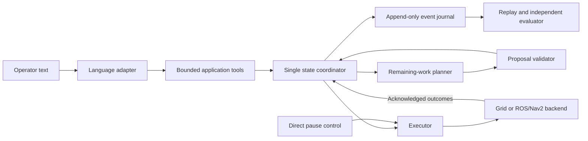

# Architecture and implementation contracts

> Update, 7 September 2026: the original simulation MVP is now implemented with local Qwen/Ollama. See [current status](status.md) and [MVP runbook](mvp-runbook.md). This document preserves the earlier, broader design/setup plan; unimplemented contracts remain future work.

The application owns mission truth. The model produces typed requests, the planner sequences valid remaining stops, and the backend reports action outcomes.

## State and records

| Record | Required fields |
| --- | --- |
| Snapshot | episode ID, semantic revision, accepted instruction revision, pose and frame, map revision, parcel states, active action, effective plan, pending request, pause state |
| Parcel | stable ID, pickup/drop location IDs, physical state, mission disposition, disposition reason |
| Request | request ID, receipt sequence/time, parsed change, lifecycle, outcome reason, effective revision if any |
| Proposal | proposal/plan ID, request ID, expected state revision, map revision, ordered stable stops, assumptions, distance, deferred obligations with reasons |
| Action | action ID, plan ID, kind, parcel/location IDs, lifecycle, attempt number, backend goal ID |
| Event | episode/event IDs, increasing sequence, type, action/request references, semantic revision, simulation time, UTC wall time, monotonic process time, payload |

Action lifecycle: queued, dispatched, active, cancellation_requested, then succeeded/failed/cancelled. Terminal action state is immutable. A retry gets a new attempt/action ID linked to its parent operation. A cargo operation is acknowledged once across retransmissions, including retransmissions with different event IDs.

Use JSONL event journals for the first implementation, with one writer. Store an episode-start configuration snapshot. Validate a transition, append its event successfully, then publish the new state; if journaling fails, hold dispatch. Replay reconstructs state and flags incomplete/truncated logs. Crash resume and exactly-once physical execution across process restarts are separate work; the first release replays for inspection and requires a new episode to run again.

## Atomic update activation

1. Register the mutating request and fence future dispatch. Capture the state used for a proposal. LLM calls run outside the coordinator.
2. Propose without modifying accepted state. Validate IDs, independently derived remaining obligations, cargo, precedence, priority rules, and finite costs.
3. `commit_plan` queues the proposal. Return `queued`, not “revision applied.” At most one candidate is pending.
4. If an action is active, allow only that authorized action to reach terminal state or request cancellation and wait for its terminal result.
5. At the boundary, read current state again. A stale revision, superseded request, or changed obligation causes a structured rejection. Recompute within the bounded retry budget.
6. In one serialized transition, validate and replace the remaining queue, update the accepted instruction revision, append `revision_effective`, then release dispatch.

The executor cannot start the next old action between steps 5 and 6. Cargo transfer requires successful navigation, terminal motion state, and waypoint tolerance. The backend cannot infer pickup from mere arrival feedback. No concurrent Nav2 goals or replacement goal before terminal cancellation acknowledgement.

## Proposed Python interfaces

Implement small typed records and protocols when the relevant ticket starts. These are contracts, not callable tools supplied by a library.

| Application tool | Result |
| --- | --- |
| `get_state()` | Authoritative compact snapshot |
| `propose_plan(change_request, expected_revision)` | Proposal or structured validation/clarification result |
| `commit_plan(plan_id, expected_revision)` | Queued proposal ID or rejection; effectiveness arrives as an event |
| `get_execution_status()` | Active progress, pending revision, failures, and unresolved obligations |
| `ask_operator(question)` | A pending clarification ID; never fabricate an answer |

Errors include `UNKNOWN_ID`, `UNSUPPORTED_OPERATION`, `STALE_STATE`, `SUPERSEDED_REQUEST`, `MISSING_OBLIGATION`, `INVALID_PRECEDENCE`, `UNREACHABLE_STOP`, `CARGO_REQUIRES_DISPOSITION`, and `RETRY_EXHAUSTED`. Errors include a fresh snapshot when appropriate; avoid free-text-only branching.

Backend protocol: `navigate(action_id, waypoint)`, `poll(action_id)`, `cancel(action_id)`, `pickup(operation_id, parcel_id)`, `drop(operation_id, parcel_id)`, `status()`. Backends report immutable observations; only the coordinator applies state transitions. Grid time advances by explicit steps. ROS callbacks feed an event queue while model requests run separately, keeping pause and feedback responsive.

## Planner adaptation

Build expected stops from current state: awaiting active parcels need pickup+drop; onboard active parcels need drop only; delivered and accepted cancellations need none; deferred jobs remain explicit unresolved obligations. Validate this set independently of route contents.

Map stable stop identities to temporary integer indices for A* cost arrays. Preserve ID correspondence in every proposal. Use a prerequisite set per stop: the old greedy implementation supports only a single dependency per destination and cannot directly encode arbitrary priority edges. Reject cycles and infinite edges; apply deterministic tie-breaking. Hill climbing must later share the same constraint checker.

The grid's row/column coordinates are not ROS poses. At ROS-02 define resolution, origin, row-axis direction, map frame and robot inflation explicitly. Nav2 handles actual motion planning; the reused A* costs are task-level travel estimates.
