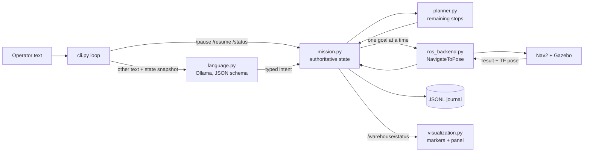

# Design

How the current system works, module by module. This document describes implemented behavior only; planned work is listed in the [README roadmap](../README.md#roadmap), and measurements are in [results](results.md).

## Principle: the model proposes, the supervisor decides

A local language model turns operator text into one typed intent. The mission supervisor validates that intent against the **current** state, owns all parcel state, and decides what work remains. Nav2 moves the robot. The model never sees coordinates, sends motion commands, runs code, or records outcomes, and its free-text explanations are never treated as evidence.

| Module | Owns | Does not |
| --- | --- | --- |
| [language.py](../warehouse_agent/language.py) | Prompt, output schema, one Ollama call per request | Validate IDs against state, plan, or act |
| [mission.py](../warehouse_agent/mission.py) | Parcel state, request effects, dispatch, cargo transfers, journal | Talk to the model or to ROS directly |
| [planner.py](../warehouse_agent/planner.py), [astar.py](../warehouse_agent/astar.py) | Remaining-stop order and travel-cost estimates | Move the robot (Nav2 plans the actual path) |
| [world.py](../warehouse_agent/world.py) | Geometry, arrival checks, generated world and maps | Hold mission state |
| [ros_backend.py](../warehouse_agent/ros_backend.py) | Nav2 goal lifecycle, cancellation, measured pose, status topic | Decide what to do next |
| [visualization.py](../warehouse_agent/visualization.py) and helpers | Markers, Qt panel, recordings | Send any robot command |

## Parcel state

Each parcel has a **physical state** and a separate **mission disposition**, so cancelling or deferring an order never erases where the parcel physically is.

| Physical state | Meaning | Changes to |
| --- | --- | --- |
| `awaiting_pickup` | On its shelf | `onboard`, only after a verified pickup |
| `onboard` | On the robot | `delivered`, only after a verified drop |
| `delivered` | On its drop pedestal | Never changes again |

| Disposition | Meaning |
| --- | --- |
| `inactive` | Not part of any mission yet |
| `active` | Part of the current mission |
| `cancelled` | Order cancelled while the parcel was still on its shelf |
| `deferred` | Two failed attempts at the same stop; physical state and cargo are kept |

These are explicit state machines in [state.py](../warehouse_agent/state.py). Every change goes through one named transition, checked against a single table, and anything else raises `IllegalTransition` instead of silently corrupting state:

| Transition | Allowed from (physical / disposition) | Result |
| --- | --- | --- |
| `activate` | shelf / inactive | shelf / active |
| `cancel` | shelf / active | shelf / cancelled |
| `pick_up` | shelf / active | onboard / active |
| `drop_off` | onboard / active | delivered / active |
| `defer` | shelf or onboard / active | unchanged / deferred |

The Nav2 goal is a second small state machine (`Goal`): idle → active → (cancelling →) idle, and dispatching while a goal is active raises. Every pause is a `Hold` with a kind and a message: `operator` (`/pause`), `clarification`, `request_failed`, or `no_route`. The mission is paused exactly when a hold exists, and the panel shows which one.

## Operator requests

Direct commands (`/pause`, `/resume`, `/status`, `/quit`) bypass the model and take effect immediately. Everything else goes to the model, which returns exactly one of these operations; [mission.py](../warehouse_agent/mission.py) `apply()` then validates it against the live state.

| Operation | Effect | Rejected when |
| --- | --- | --- |
| `create` | Activates the listed parcels | A mission is still running, or a listed parcel was already used |
| `prioritize` | Serves one parcel's remaining stops before others | Not exactly one active, undelivered parcel |
| `onboard_first` | Delivers the parcels onboard *at that moment* before any new pickup | — |
| `cancel` | Cancels uncollected parcels and cancels the robot's goal if it was heading to one of them | A parcel is delivered or not active. If any listed parcel is **onboard**, nothing in the request is cancelled; the mission pauses and asks whether to continue that delivery |
| `pause` / `resume` | Stops motion (via Nav2 cancel) / continues remaining work | — |
| `status` | Returns the supervisor's snapshot, not the model's text | — |
| `clarify` | Pauses the mission and asks the operator the model's question | — |

Every request has an ID and ends in exactly one recorded outcome. Model requests are `R1, R2, …`: `submit()` records `language_requested` and raises the cargo fence, and `resolve()` ends the request as `request_superseded` (a `/pause` arrived first), `request_failed` (model error or rejected request), `status_reported`, `clarification_required`, or `instruction_applied`. Only one model request is interpreted at a time. Direct commands are `D1, D2, …`. The journal records the normalized command that was actually applied (for example, repeated parcel IDs collapsed), not the raw model output.

Unknown parcel IDs are rejected before anything changes. A rejected or failed request (including a model error or timeout) pauses the mission and cancels the current goal, so nothing proceeds on an interpretation the supervisor could not accept.

## Execution loop

The CLI runs a single-threaded loop about 20 times per second. Keyboard input arrives through a queue, and the model call runs on one worker thread with a copy of the state; **all state changes happen on the loop thread**. Each `tick()`:

1. Polls the backend. At most one Nav2 goal is active; the backend refuses a second.
2. When the goal reaches a terminal result, records `navigation_finished`. If a cancel was requested, the mission is paused, or the parcel is no longer active, cargo does not change, even if Nav2 reports success.
3. Otherwise, transfers cargo only if Nav2 **succeeded** and the measured pose passes every [arrival check](#arrival-verification). Anything else counts as a failed attempt: one retry, then the parcel is deferred with the measured errors as the reason.
4. Replans the remaining stops from the current state and pose, then dispatches the first stop.

**Timing rules that keep state consistent:**

- **Cancel waits for Nav2.** Pause and cancel request cancellation, then wait for Nav2's terminal result before anything new is dispatched. The backend stops the supervisor if a cancel does not complete within 20 s or a goal is not acknowledged within 20 s.
- **Cargo is frozen while the model is thinking.** If a goal finishes while a request is being interpreted, its result is held and applied only after the request resolves, so the request is judged against the state the operator saw. No new stop is dispatched meanwhile.
- **`/pause` wins over a pending model request.** The model's answer is discarded when it arrives, and a new request is refused until the pending one resolves.
- **Planning failures hold instead of crashing.** If no route can be estimated from the current pose, the mission pauses with a `no_route` hold, records `planning_failed` once, and waits for `/resume`.

## Planning

The planner rebuilds the remaining stops from live state at every action boundary: a pickup and a drop for each active parcel on its shelf, and only a drop for each active parcel onboard. It then orders them greedily from the robot's current pose:

1. Only pickups, or drops of parcels already onboard at that point in the sequence, are eligible.
2. Drops of parcels captured by `onboard_first` go first; otherwise the prioritized parcel's stops; otherwise all eligible stops.
3. The nearest candidate by estimated travel cost is chosen (ties broken by parcel ID, then stop kind).

Travel costs come from the [WarehouseBot](reference-audit.md) A* on a 0.2 m, 4-connected grid whose obstacles are inflated by 0.35 m, with results cached per pair of cells. A pose inside the inflated band (legal for Nav2's 0.22 m robot radius) is snapped to the nearest free cell within 0.55 m, which is too short to cross a rack. These costs only order the stops; Nav2 computes the real path. The greedy order is not guaranteed optimal.

## Arrival verification

Nav2 converges to 0.12 m and 0.10 rad. The supervisor then independently checks the measured pose (TF `map → base_link`) against [config/warehouse.json](../config/warehouse.json) before any transfer:

| Check | Limit |
| --- | --- |
| Distance from the approach pose | ≤ 0.20 m |
| Heading error from the approach orientation | ≤ 0.22 rad |
| Facing error toward the parcel from the measured position | ≤ 0.25 rad |
| Clearance between conservative robot and parcel footprints | ≥ 0.20 m |

Approach poses are 1.0 m in front of each parcel. Pickup and drop are logical state changes; there is no arm or grasping, and the parcel markers only reflect confirmed state.

## One geometry source

[world.py](../warehouse_agent/world.py) generates everything from [config/warehouse.json](../config/warehouse.json): the Gazebo SDF world with collision boxes for shelves, pedestals and walls, the 0.05 m Nav2 occupancy map, the planning grid, the spawn pose, and the overview camera. [sim_config.py](../warehouse_agent/sim_config.py) derives Nav2 parameters from the stock defaults, setting the initial AMCL pose at HOME and a tighter localization model tuned after a pose jump between similar shelf faces. The [layout guide](warehouse-layout.md) shows the floor plan.

## ROS interfaces

The [warehouse_interfaces](../ros_ws/src/warehouse_interfaces) package defines the project's typed ROS 2 API. It is built with colcon into `ros_ws/`; the launch scripts build it automatically when its sources change.

| Interface | Purpose |
| --- | --- |
| `msg/MissionStatus` | The authoritative snapshot, published on `/warehouse/mission_status` (transient local) |
| `msg/Parcel`, `msg/Stop`, `msg/Hold` | Parts of the status; state, disposition, stop, and hold kinds are message constants |
| `srv/SubmitRequest`, `srv/OperatorCommand` | Natural-language requests and direct `/pause`, `/resume`, `/status` |
| `action/ApproachAndVerify` | Drive to an approach pose with Nav2, then report the measured pose checks |

[ros_messages.py](../warehouse_agent/ros_messages.py) converts snapshots to and from `MissionStatus`; a test round-trips real supervisor snapshots through it and checks that the message constants match the state machines. The JSON `/warehouse/status` topic is still published for the current viewer. The services and the action are defined but not yet served.

## Journal and status

Every state change is appended to a JSONL journal under `artifacts/episodes/`, flushed per event. Each event carries a sequence number, UTC and monotonic timestamps, and the state revision.

| Events | Recorded when |
| --- | --- |
| `episode_started`, `episode_closed` | Supervisor start (with the full config) and shutdown |
| `language_requested`, `language_interpreted` | Text sent to the model; intent returned, with model latency and token count |
| `instruction_applied`, `status_reported`, `request_failed`, `request_superseded`, `clarification_required` | Request outcomes, each tagged with its request ID |
| `plan_selected`, `navigation_started`, `navigation_cancel_requested`, `navigation_finished` | Planning and Nav2 goal lifecycle |
| `cargo_pickup`, `cargo_drop` | Verified transfers, with the full arrival report and pose |
| `navigation_retry`, `parcel_deferred`, `planning_failed` | Failures and holds |
| `mission_finished` | All active work is done (`complete`) or some was deferred (`partial`) |

The current snapshot is also published on `/warehouse/status` (transient local). The visualization process renders it as RViz and Gazebo markers and in the Qt mission panel; if no snapshot arrives for 3 s it shows the last known state as disconnected.

## Verification

Three layers check that the rules above actually hold:

- **Independent journal checker** ([verify.py](../warehouse_agent/verify.py), `python3 -B -m warehouse_agent verify JOURNAL...`). It rebuilds the mission from the journal alone and checks every rule: ordering, one request and one goal at a time, exactly one outcome per request ID, normalized commands, the fence, plans covering exactly the owed stops, transfers only after a matching verified arrival and within tolerance, one retry before deferring, legal state changes, and the supervisor's own snapshots matching the replay. It shares no code with the supervisor, and it takes limits from each journal's recorded config, so it also checks journals from older versions.
- **Property-based tests** ([test_properties.py](../tests/test_properties.py), Hypothesis). Hundreds of random sessions drive the real supervisor with operator requests (including malformed model output), pauses, Nav2 results on and off target, cancels racing arrivals, and the robot drifting into racks. Every snapshot and every final journal must pass the checker, and every uninterrupted mission must terminate.
- **Mutation check** ([mutation_check.py](../scripts/mutation_check.py)). It plants realistic bugs in a scratch copy of the supervisor, such as skipping the arrival check or moving cargo after a cancel, and requires the property tests to catch every one.

## Known limitations

These are the current boundaries, each addressed by the [roadmap](../README.md#roadmap):

- One robot, three parcels with fixed stations; the prompt lists the parcels directly rather than generating them from the config.
- One operation per request. Orders cannot be added mid-mission, and destination changes and returns are not supported.
- A clarification or failed request pauses the whole mission. A deferred parcel cannot be retried in the same session.
- Each supervisor start is a fresh logical mission. The journal is written, but there is no replay tool or crash recovery.
- Greedy sequencing is not optimal, and grid costs are estimates.
- The supervisor is a plain Python process polling `rclpy`, not a colcon package or lifecycle node. Status is JSON in `std_msgs/String`, and timeouts use wall-clock time although the nodes run on simulation time. A goal that is never acknowledged, or a cancel that never completes, stops the supervisor process.
- Arrival checks use the localization estimate, not a sensor observation of the parcel.
- Simulation only.
